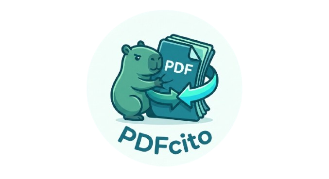

# PDFcito 📄📉

PDFcito es una aplicación de escritorio moderna y minimalista construida con **Electron** que permite comprimir archivos PDF de forma sencilla utilizando **Ghostscript**.



## Características

- **Diseño Teal/Cyan oscuro**: Interfaz elegante y profesional.
- **Drag & Drop**: Arrastra tus archivos o usa el selector nativo.
- **Niveles de Compresión**:
  - `Pantalla (72 dpi)`: Máximo ahorro, calidad baja.
  - `eBook (150 dpi)`: Balance ideal entre calidad y tamaño.
  - `Impresora (300 dpi)`: Alta calidad para documentos impresos.
  - `Pre-prensa (300 dpi)`: Mantiene la fidelidad del color.
- **Privacidad**: Todo el procesamiento se realiza localmente en tu computadora.

---

## 🛠 Requisito Indispensable: Ghostscript

PDFcito utiliza **Ghostscript** como motor de compresión. Tienes dos opciones para que la app funcione:

### Opción A: Instalación en el Sistema (Recomendado para desarrollo)

#### En Linux (Debian/Ubuntu/Fedora):
```bash
# Ubuntu/Debian
sudo apt update && sudo apt install ghostscript

# Fedora
sudo dnf install ghostscript
```

#### En Windows:
1. Descarga el instalador de [Ghostscript Downloads](https://ghostscript.com/releases/gsdnld.html) (selecciona **Ghostscript AGPL Release** para Windows 64-bit).
2. Ejecuta el instalador.
3. Asegúrate de añadir la carpeta `bin` de Ghostscript (ej. `C:\Program Files\gs\gs10.xx.x\bin`) a las **Variables de Entorno (PATH)** del sistema.

---

### Opción B: Incluir Binarios en la App (Para empaquetar)

Si deseas distribuir la aplicación sin que el usuario tenga que instalar nada, debes colocar los binarios directamente en la carpeta del proyecto antes de compilar:

1. Crea las carpetas si no existen: `mkdir bin`
2. Copia el ejecutable en la carpeta `bin/`:
   - En **Linux**: El archivo `gs` (usualmente en `/usr/bin/gs`).
   - En **Windows**: El archivo `gswin64c.exe` (usualmente en `C:\Program Files\gs\gsXXXX\bin\gswin64c.exe`).

La aplicación detectará automáticamente estos archivos al iniciarse.

---

## 🚀 Instalación y Uso

1. **Clona el repositorio:**
   ```bash
   git clone https://github.com/BruMaster7/pdfcito.git
   cd pdfcito
   ```

2. **Instala las dependencias:**
   ```bash
   npm install
   ```

3. **Inicia la aplicación:**
   ```bash
   npm start
   ```

4. **Para crear los instaladores (.exe, .AppImage, .deb):**
   ```bash
   npm run dist
   ```

## Estructura del Proyecto

- `src/main.js`: Lógica del proceso principal y ejecución de Ghostscript.
- `src/renderer.js`: Lógica de la interfaz de usuario.
- `src/binaries.js`: Localizador automático de Ghostscript.
- `index.html` & `style.css`: Estructura y diseño premium.

---